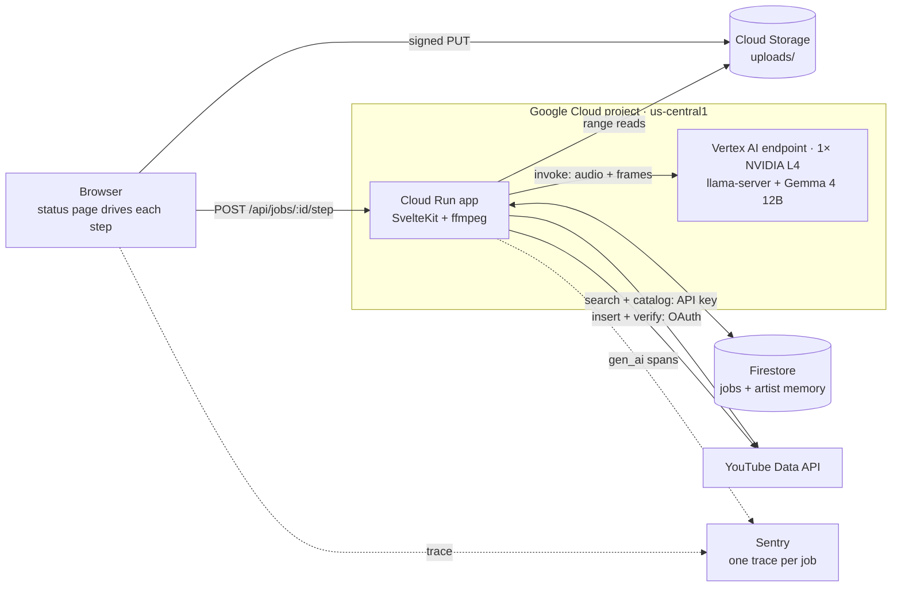

# 🎛️ Soundboard

Soundboard analyzes a finished music video and drafts its YouTube title, description, hashtags, and tags. The artist approves, edits, or re-runs the draft; on approval, Soundboard uploads the video as private and confirms the upload through the YouTube API.

[](https://soundboard.anchildress1.dev)
[](https://dev.to/anchildress1/20-years-of-friendship-one-weekend-to-build-his-marketing-department-23c9-temp-slug-938322?preview=f731687adb96e0fe58253c4699ccf0957b2dc3e5a70455cc0e76de3a9787cd2e234b928b92371a51327d88b5d479b434078e40ffbedef2978b9b0cc1)
[](https://github.com/anchildress1/soundboard/actions/workflows/ci.yml)
[](https://github.com/anchildress1/soundboard/actions/workflows/codeql.yml)
[](https://sonarcloud.io/summary/new_code?id=anchildress1_soundboard)
[](https://sonarcloud.io/summary/new_code?id=anchildress1_soundboard)
[](LICENSE)


Built for [Flies Like Robots](https://www.youtube.com/@flieslikerobots) as an entry in the [DEV Hacktoberfest Weekend Challenge: Build for a Friend](https://dev.to/challenges/hacktoberfest-weekend-2026-10-01). Try it at [soundboard.anchildress1.dev](https://soundboard.anchildress1.dev), and read [the submission](https://dev.to/anchildress1/20-years-of-friendship-one-weekend-to-build-his-marketing-department-23c9-temp-slug-938322?preview=f731687adb96e0fe58253c4699ccf0957b2dc3e5a70455cc0e76de3a9787cd2e234b928b92371a51327d88b5d479b434078e40ffbedef2978b9b0cc1).

<p align="center">
  
</p>

---

## Table of Contents

- [About](#about)
- [Features](#features)
- [Tech Stack](#tech-stack)
- [Architecture](#architecture)
- [Getting Started](#getting-started)
- [Configuration](#configuration)
- [Security](#security)
- [How to Contribute](#how-to-contribute)
- [License](#license)
- [Acknowledgements](#acknowledgements)
- [Author](#author)

---

## About

Nathan writes, records, and films his own music. Publishing each video still takes metadata work: a title, a description, tags, hashtags, consistency with the rest of the channel, and a check that the audio isn't clipping or dropping out.

Soundboard produces one complete draft of that metadata for Nathan to review, instead of a set of options to choose from.

The model is Gemma 4 12B-it, an open-weight model released by Google DeepMind under [Apache 2.0](https://huggingface.co/google/gemma-4-12B-it). It runs on a GPU in our own Google Cloud project, so unreleased audio is never sent to a third-party inference provider.

---

## Features

| Feature                  | Description                                                                                                                                                                                                             |
| ------------------------ | ----------------------------------------------------------------------------------------------------------------------------------------------------------------------------------------------------------------------- |
| Audio and video analysis | Each 29.5-second window of audio, plus 8 frames from it, is analyzed by Gemma                                                                                                                                           |
| Audio measurements       | Loudness, true peak, clipping, and silence are measured with ffmpeg, not estimated by the model                                                                                                                         |
| Upload checks            | "Check before uploading" lists only measured problems: ffmpeg's findings, the Short notice for vertical or square videos of 3 minutes or less, and problems a window analysis heard or saw. The model can't add its own |
| Metadata draft           | One title, description, hashtag set, and tag set, grounded in the most-viewed music videos for its genre                                                                                                                |
| Hashtag candidates       | Hashtags are chosen from a deterministic search of existing videos                                                                                                                                                      |
| Review                   | Edit any field, re-run for a new draft, or approve; edits and approvals inform later drafts                                                                                                                             |
| Verified upload          | Uploads as private, then reads the video back from the YouTube API before marking it verified                                                                                                                           |
| Metadata diff            | For an existing video, shows current and proposed metadata side by side with the reason for each change                                                                                                                 |
| Brand guide              | Reads the channel's 30 latest videos (up to 8 tags each, to fit the model's 8K context) and 10 thumbnails and proposes keep / fix / drop rules; once Nathan approves them, every draft for his channel follows them     |
| Short                    | Gemma picks the hook, ffmpeg's loudness places the cut, and ffmpeg fits it to 9:16 for review and the same private, verified upload; no generated frames                                                                |
| Tracing                  | One Sentry trace per job, with each Gemma call recorded as an AI agent span                                                                                                                                             |

---

## Tech Stack

| Layer         | Choice                                                                                                  |
| ------------- | ------------------------------------------------------------------------------------------------------- |
| App           | SvelteKit 2 + Svelte 5, TypeScript, Node 24                                                             |
| Model         | Gemma 4 12B-it, Google's official QAT Q4_0 GGUF + vision/audio projector, on `llama-server` (llama.cpp) |
| Media         | ffmpeg                                                                                                  |
| Hosting       | Cloud Run (app) + a Vertex AI endpoint with one NVIDIA L4 (model), us-central1                          |
| Data          | Firestore, Cloud Storage, Secret Manager                                                                |
| YouTube       | YouTube Data API v3                                                                                     |
| Observability | Sentry (AI agent tracing)                                                                               |
| Tooling       | pnpm, Vitest, Playwright, ESLint, Prettier, Lefthook, commitlint, Release Please                        |

---

## Architecture



- The app runs on Cloud Run with no GPU. The model runs on a Vertex AI dedicated endpoint, which the app calls with its service account. Both run at most one instance and scale to zero when idle; the first call to a sleeping model wakes it, and the page shows "waking model" until it answers.
- The model costs about $0.81/hour while its replica is up (`g2-standard-4` with the L4) and nothing while scaled to zero. A wake bills at least 5 minutes.
- The status page runs the pipeline one step per request (prep, one chunk at a time, then the draft; a Short adds a hook pick and a render). Reloading the page resumes from the next unfinished step.
- The full design is in [docs/prd.md](docs/prd.md).

---

## Getting Started

**Prerequisites:** [Volta](https://volta.sh) (pins Node and pnpm per project), ffmpeg, [gitleaks](https://github.com/gitleaks/gitleaks), [actionlint](https://github.com/rhysd/actionlint), and the `gcloud` CLI for deploys.

```bash
git clone git@github.com:anchildress1/soundboard.git
cd soundboard
cp .env.example .env
make install
make dev
```

| Command            | What it does                                                                                                  |
| ------------------ | ------------------------------------------------------------------------------------------------------------- |
| `make dev`         | Start the dev server                                                                                          |
| `make ai-checks`   | Format, lint, typecheck, test, build                                                                          |
| `make e2e`         | Playwright end-to-end tests                                                                                   |
| `make deploy`      | Deploy the model endpoint if its image changed, then build and deploy the app (requires a clean working tree) |
| `make model-image` | Build the Gemma 4 model image on Cloud Build; skipped if `model/` is unchanged                                |

### Operating it

- **Connect channels:** sign in with an allowlisted account, then use the footer's _Connect channel_ links. _Nathan_ must be consented by Nathan's Google account; _Sandbox_ by the throwaway channel's. Each stores a YouTube refresh token in Secret Manager (`yt-refresh-nathan`, `yt-refresh-sandbox`).
- **OAuth consent screen:** set it to _In production_ before connecting; Testing-mode refresh tokens expire after 7 days. Add `https://soundboard.anchildress1.dev/auth/callback` as a redirect URI.
- **Brand guide:** allowlisted accounts get a _Brand guide_ footer link to `/brand`. _Propose_ reads the latest uploads; edit the statement and rules, then _Approve_. Drafts for Nathan's channel follow the approved guide; visitor runs never read it.
- **Model deploys:** the first `make deploy` uploads the model image and deploys it to the endpoint; expect 20+ minutes. Vertex can fail a deploy with a generic system error when no L4 is free in us-central1. Check the operation before running `make deploy` again, since a rerun while one is still running starts a second deploy. A model left idle for 30 days is undeployed automatically; `make deploy` puts it back.
- **Samples:** `scripts/add-sample.sh <video> <youtube-video-id> "<song title>"` cuts the loudest 30 seconds, uploads it to `samples/`, and registers it on the home page.

---

## Configuration

Values live in `.env` for local development and in Secret Manager or Cloud Run environment variables when deployed. Do not commit real values.

| Variable                                                | Purpose                                                                                          |
| ------------------------------------------------------- | ------------------------------------------------------------------------------------------------ |
| `GCP_PROJECT_ID`                                        | Project that hosts the service, bucket, and Firestore                                            |
| `GCS_BUCKET`                                            | Bucket for uploads (`uploads/`, deleted after 7 days) and samples (`samples/`)                   |
| `MODEL_URL`                                             | `llama-server` base URL for local development; `deploy.sh` sets the Vertex endpoint's invoke URL |
| `MODEL_IMAGE`                                           | Model container image from `make model-image`; required by `deploy.sh`                           |
| `YOUTUBE_API_KEY`                                       | Read-only key from a second GCP project, used for search and catalog reads                       |
| `FLR_CHANNEL_ID`                                        | The Flies Like Robots channel ID                                                                 |
| `GOOGLE_OAUTH_CLIENT_ID` / `GOOGLE_OAUTH_CLIENT_SECRET` | Google sign-in and YouTube upload authorization                                                  |
| `ALLOWLIST_EMAILS`                                      | Comma-separated emails allowed to upload to Nathan's channel                                     |
| `DEMO_EMAILS`                                           | Comma-separated demo accounts: run like Nathan, upload to the sandbox, save nothing              |
| `SESSION_SECRET`                                        | Signs the sign-in session cookie                                                                 |
| `PUBLIC_SENTRY_DSN`                                     | Sentry DSN (public by design)                                                                    |
| `SENTRY_AUTH_TOKEN` (in `.env.sentry-build-plugin`)     | Optional. Lets deploys upload source maps; stored in Secret Manager for Cloud Build only         |

---

## Security

- Video and audio are stored only in Cloud Storage and processed only by the model running on a Vertex AI endpoint in the same project. Sentry receives text, with audio and images replaced by size-only placeholders.
- Signed-out visitors run against a separate test channel. Only allowlisted Google accounts can upload to Nathan's channel or read his jobs and stored preferences.
- Secrets live in Secret Manager or a local `.env`. YouTube refresh tokens stay on the server.
- Firestore denies all client access; only the app's service account reads and writes.
- Upload URLs are size-capped, and uploaded files are deleted after 7 days.

---

## How to Contribute

Issues and pull requests are welcome.

- Branch from `main` and open a pull request; `main` is not committed to directly.
- Use [Conventional Commits](https://www.conventionalcommits.org), GPG-signed, with an AI attribution footer and `Signed-off-by`. commitlint and [rai-lint](https://github.com/anchildress1/rai-lint) enforce this.
- Run `make ai-checks` before pushing.

---

## License

This repository's code is licensed under [MIT](LICENSE): you may use, modify, and redistribute it, including commercially, as long as the copyright notice is kept.

Gemma 4's model weights are not part of this repository. Google DeepMind distributes them separately under [Apache 2.0](https://huggingface.co/google/gemma-4-12B-it-qat-q4_0-gguf).

---

## Acknowledgements

- **Nathan (Flies Like Robots)**, for the music and for being the first user.
- **DEV** and **MLH**, for running the Hacktoberfest Weekend Challenge that prompted this build.
- **Google DeepMind** for Gemma, and the **llama.cpp** maintainers for `llama-server`.

---

## Author

**Ashley Childress** — [@anchildress1](https://github.com/anchildress1) · [dev.to/anchildress1](https://dev.to/anchildress1)
