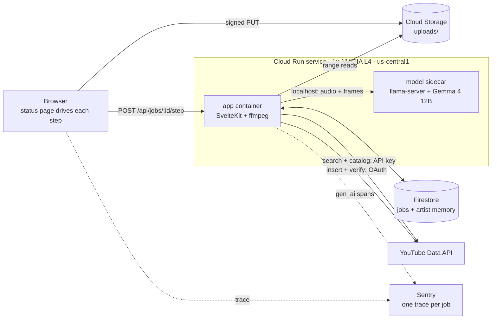

# 🎛️ Soundboard

Soundboard analyzes a finished music video and drafts its YouTube title, description, hashtags, and tags. The artist approves, edits, or re-runs the draft; on approval, Soundboard uploads the video as private and confirms the upload through the YouTube API.

[](LICENSE)

Built for [Flies Like Robots](https://www.youtube.com/@flieslikerobots) as an entry in the [DEV Hacktoberfest Weekend Challenge: Build for a Friend](https://dev.to/challenges/hacktoberfest-weekend-2026-10-01).

> **Status:** in development during the challenge weekend (October 3–5, 2026). The repository currently holds the scaffold; the features below are the planned scope from [docs/prd.md](docs/prd.md).

---

## Table of Contents

- [About](#about)
- [Features](#features)
- [Tech Stack](#tech-stack)
- [Architecture](#architecture)
- [Getting Started](#getting-started)
- [Configuration](#configuration)
- [Security](#security)
- [How to Contribute](#how-to-contribute)
- [License](#license)
- [Acknowledgements](#acknowledgements)
- [Author](#author)
- [Commits after 2026-10-05 06:59 UTC](#commits-after-2026-10-05-0659-utc)

---

## About

Nathan writes, records, and films his own music. Publishing each video still takes metadata work: a title, a description, tags, hashtags, consistency with the rest of the channel, and a check that the audio isn't clipping or dropping out.

Soundboard produces one complete draft of that metadata for Nathan to review, instead of a set of options to choose from.

The model is Gemma 4 12B-it, an open-weight model released by Google DeepMind under [Apache 2.0](https://huggingface.co/google/gemma-4-12B-it). It runs on a GPU in our own Google Cloud project, so unreleased audio is never sent to a third-party inference provider.

---

## Features

| Feature                  | Description                                                                                             |
| ------------------------ | ------------------------------------------------------------------------------------------------------- |
| Audio and video analysis | Each 29.5-second window of audio, plus 8 frames from it, is analyzed by Gemma                           |
| Audio measurements       | Loudness, true peak, clipping, and silence are measured with ffmpeg, not estimated by the model         |
| Metadata draft           | One title, description, hashtag set, and tag set, compared against the channel's 5 most recent videos   |
| Hashtag candidates       | Hashtags are chosen from a deterministic search of existing videos                                      |
| Review                   | Edit any field, re-run for a new draft, or approve; edits and approvals inform later drafts             |
| Verified upload          | Uploads as private, then reads the video back from the YouTube API before marking it verified           |
| Metadata diff            | For an existing video, shows current and proposed metadata side by side with the reason for each change |
| Tracing                  | One Sentry trace per job, with each Gemma call recorded as an AI agent span                             |

---

## Tech Stack

| Layer         | Choice                                                                                                  |
| ------------- | ------------------------------------------------------------------------------------------------------- |
| App           | SvelteKit 2 + Svelte 5, TypeScript, Node 24                                                             |
| Model         | Gemma 4 12B-it, Google's official QAT Q4_0 GGUF + vision/audio projector, on `llama-server` (llama.cpp) |
| Media         | ffmpeg                                                                                                  |
| Hosting       | One Cloud Run service with an NVIDIA L4 GPU, us-central1                                                |
| Data          | Firestore, Cloud Storage, Secret Manager                                                                |
| YouTube       | YouTube Data API v3                                                                                     |
| Observability | Sentry (AI agent tracing)                                                                               |
| Tooling       | pnpm, Vitest, Playwright, ESLint, Prettier, Lefthook, commitlint, Release Please                        |

---

## Architecture



- The app and the model run as two containers in one Cloud Run instance and communicate over `localhost`. The service runs at most one instance and scales to zero when idle.
- The status page runs the pipeline one step per request (prep, one chunk at a time, then the draft). Reloading the page resumes from the next unfinished step.
- The full design is in [docs/prd.md](docs/prd.md).

---

## Getting Started

**Prerequisites:** [Volta](https://volta.sh) (pins Node and pnpm per project), ffmpeg, [gitleaks](https://github.com/gitleaks/gitleaks), [actionlint](https://github.com/rhysd/actionlint), and the `gcloud` CLI for deploys.

```bash
git clone git@github.com:anchildress1/soundboard.git
cd soundboard
cp .env.example .env
make install
make dev
```

| Command          | What it does                                                  |
| ---------------- | ------------------------------------------------------------- |
| `make dev`       | Start the dev server                                          |
| `make ai-checks` | Format, lint, typecheck, test, build                          |
| `make e2e`       | Playwright end-to-end tests                                   |
| `make deploy`    | Build and deploy to Cloud Run (requires a clean working tree) |

---

## Configuration

Values live in `.env` for local development and in Secret Manager or Cloud Run environment variables when deployed. Do not commit real values.

| Variable                                                | Purpose                                                                    |
| ------------------------------------------------------- | -------------------------------------------------------------------------- |
| `GCP_PROJECT_ID`                                        | Project that hosts the service, bucket, and Firestore                      |
| `GCS_BUCKET`                                            | Bucket for uploads                                                         |
| `MODEL_URL`                                             | `llama-server` base URL; `http://127.0.0.1:8081` in the deployed sidecar   |
| `MODEL_IMAGE`                                           | Container image for the model sidecar; required by `deploy.sh`             |
| `YOUTUBE_API_KEY`                                       | Read-only key from a second GCP project, used for search and catalog reads |
| `FLR_CHANNEL_ID`                                        | The Flies Like Robots channel ID                                           |
| `GOOGLE_OAUTH_CLIENT_ID` / `GOOGLE_OAUTH_CLIENT_SECRET` | Google sign-in and YouTube upload authorization                            |
| `ALLOWLIST_EMAILS`                                      | Comma-separated emails allowed to upload to Nathan's channel               |
| `SESSION_SECRET`                                        | Signs the sign-in session cookie                                           |
| `PUBLIC_SENTRY_DSN`                                     | Sentry DSN (public by design)                                              |

---

## Security

Planned controls, from [docs/prd.md](docs/prd.md):

- Video and audio are stored only in Cloud Storage and processed only by the model running in the same Cloud Run instance. Sentry receives text, with audio and images replaced by size-only placeholders.
- Signed-out visitors run against a separate test channel. Only allowlisted Google accounts can upload to Nathan's channel or read his jobs and stored preferences.
- Secrets live in Secret Manager or a local `.env`. YouTube refresh tokens stay on the server.
- Firestore denies all client access; only the app's service account reads and writes.
- Upload URLs are size-capped, and uploaded files are deleted after 7 days.

---

## How to Contribute

Issues and pull requests are welcome.

- Branch from `main` and open a pull request; `main` is not committed to directly.
- Use [Conventional Commits](https://www.conventionalcommits.org), GPG-signed, with an AI attribution footer and `Signed-off-by`. commitlint and [rai-lint](https://github.com/anchildress1/rai-lint) enforce this.
- Run `make ai-checks` before pushing.

---

## License

This repository's code is licensed under [MIT](LICENSE): you may use, modify, and redistribute it, including commercially, as long as the copyright notice is kept.

Gemma 4's model weights are not part of this repository. Google DeepMind distributes them separately under [Apache 2.0](https://huggingface.co/google/gemma-4-12B-it-qat-q4_0-gguf).

---

## Acknowledgements

- **Nathan (Flies Like Robots)**, for the music and for being the first user.
- **DEV** and **MLH**, for running the Hacktoberfest Weekend Challenge that prompted this build.
- **Google DeepMind** for Gemma, and the **llama.cpp** maintainers for `llama-server`.

---

## Author

**Ashley Childress** — [@anchildress1](https://github.com/anchildress1) · [dev.to/anchildress1](https://dev.to/anchildress1)

---

## Commits after 2026-10-05 06:59 UTC

None yet. Any commit made after the challenge deadline will be listed here with a description of what it changed.
