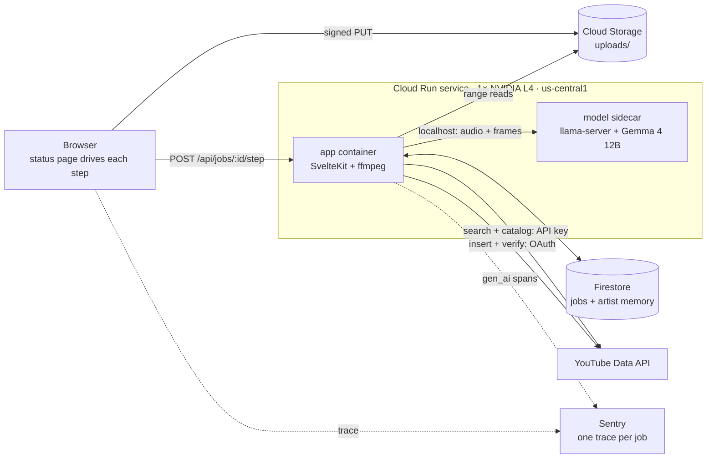

# 🎛️ Soundboard

A release agent for one musician. It watches and listens to a finished music video, compares it to the channel's recent catalog, and hands back one YouTube title, description, and tag set to approve — then uploads it and checks that the upload actually landed.

[](LICENSE)

> Built for [Nathan](https://www.youtube.com/@flieslikerobots) (Flies Like Robots) for the [DEV Hacktoberfest Weekend Challenge: Build for a Friend](https://dev.to/challenges/hacktoberfest-weekend-2026-10-01).

---

## Table of Contents

- [About](#about)
- [Features](#features)
- [Tech Stack](#tech-stack)
- [Architecture](#architecture)
- [Getting Started](#getting-started)
- [Configuration](#configuration)
- [Security](#security)
- [How to Contribute](#how-to-contribute)
- [License](#license)
- [Acknowledgements](#acknowledgements)
- [Author](#author)
- [Commits after 2026-10-05 06:59 UTC](#commits-after-2026-10-05-0659-utc)

---

## About

Nathan makes the music and makes the videos for it. The part that stalls is everything after: titles, descriptions, tags, hashtags, keeping the channel consistent, and noticing the master clips before the whole internet does.

Soundboard does that work first and asks Nathan for one decision. It never hands him a list of options or a blank form.

The model is **Gemma 4 12B-it**, open-weight under the [Gemma Terms of Use](https://ai.google.dev/gemma/terms), running on a GPU in our own Google Cloud project. No inference provider sees Nathan's unreleased audio. That's the whole reason this is built on open weights.

---

## Features

| Feature                   | What it does                                                                                            |
| ------------------------- | ------------------------------------------------------------------------------------------------------- |
| 🎧 Watches and listens    | Every 29.5 seconds of audio plus 8 frames per window go to Gemma; it describes what it hears and sees   |
| 📏 Real measurements      | Loudness, true peak, clipping, and silence come from ffmpeg — the model never invents a number          |
| 🎯 One recommendation     | Title, description, hashtags, and tags in one draft, matched to the channel's 5 most recent videos      |
| #️⃣ Hashtags from a search | Candidates come from a deterministic search of real videos; the model picks from them and nothing else  |
| 🔁 Re-run, edit, approve  | Edit in place or re-run for a new take; Soundboard learns from both                                     |
| ✅ Verified uploads       | Uploads as private, then reads the video back from YouTube before calling it done                       |
| 🔍 Before / after diff    | For existing videos, shows current vs proposed metadata field by field, with the reason for each change |
| 📡 Agent traces           | One Sentry trace per job, with Gemma calls as AI-agent spans                                            |

---

## Tech Stack

| Layer         | Choice                                                                              |
| ------------- | ----------------------------------------------------------------------------------- |
| App           | SvelteKit 2 + Svelte 5, TypeScript, Node 24                                         |
| Model         | Gemma 4 12B-it (Q4_K_M GGUF + vision/audio projector) on `llama-server` (llama.cpp) |
| Media         | ffmpeg                                                                              |
| Hosting       | One Cloud Run service with an NVIDIA L4 GPU, us-central1                            |
| Data          | Firestore, Cloud Storage, Secret Manager                                            |
| YouTube       | YouTube Data API v3                                                                 |
| Observability | Sentry (AI agent tracing)                                                           |
| Tooling       | pnpm, Vitest, Playwright, ESLint, Prettier, Lefthook, commitlint, Release Please    |

---

## Architecture



- **One service, one GPU.** The app and the model share an instance and talk over `localhost`. Max one instance, scale to zero: it costs nothing while nobody's using it.
- **The page drives the run.** Each step (prep, one chunk, pick) is its own short request, so a reload picks up where it left off.
- **Full design:** [docs/prd.md](docs/prd.md).

---

## Getting Started

**Prerequisites:** [Volta](https://volta.sh) (pins Node and pnpm per project), ffmpeg, [gitleaks](https://github.com/gitleaks/gitleaks), [actionlint](https://github.com/rhysd/actionlint), and the `gcloud` CLI for deploys.

```bash
git clone git@github.com:anchildress1/soundboard.git
cd soundboard
cp .env.example .env
make install
make dev
```

| Command          | What it does                         |
| ---------------- | ------------------------------------ |
| `make dev`       | Start the dev server                 |
| `make ai-checks` | Format, lint, typecheck, test, build |
| `make e2e`       | Playwright end-to-end tests          |
| `make deploy`    | Build and deploy to Cloud Run        |

---

## Configuration

All values live in `.env` locally and in Secret Manager or service env vars on Cloud Run. Never commit real values.

| Variable                                                | Purpose                                                                  |
| ------------------------------------------------------- | ------------------------------------------------------------------------ |
| `GCP_PROJECT_ID`                                        | Project that hosts the service, bucket, and Firestore                    |
| `GCS_BUCKET`                                            | Bucket for uploads (7-day delete rule)                                   |
| `MODEL_URL`                                             | `llama-server` base URL; `http://127.0.0.1:8081` in the deployed sidecar |
| `YOUTUBE_API_KEY`                                       | Read-only key from a second GCP project (search and catalog reads)       |
| `FLR_CHANNEL_ID`                                        | The Flies Like Robots channel ID                                         |
| `GOOGLE_OAUTH_CLIENT_ID` / `GOOGLE_OAUTH_CLIENT_SECRET` | Google sign-in and YouTube upload authorization                          |
| `ALLOWLIST_EMAILS`                                      | Comma-separated emails that can target Nathan's channel                  |
| `SESSION_SECRET`                                        | Signs the sign-in session cookie                                         |
| `PUBLIC_SENTRY_DSN`                                     | Sentry DSN (public by design)                                            |

---

## Security

- **Audio stays home.** Media goes only to Cloud Storage and the in-instance model. Sentry receives text and size-only placeholders for audio and images.
- **Two kinds of visitor.** Signed out, you can run everything against a throwaway channel. Only allowlisted Google accounts can touch Nathan's channel, his jobs, or his learned preferences.
- **Secrets** live in Secret Manager or a local `.env`. YouTube refresh tokens never reach the browser.
- **Firestore** rules deny all client access; only the app's service account reads and writes.
- **Uploads** are size-capped at the signed URL and deleted after 7 days.

---

## How to Contribute

This is a weekend build for one person, but issues and PRs are welcome.

- Branch from `main`; open a PR. Nothing lands on `main` directly.
- [Conventional Commits](https://www.conventionalcommits.org), GPG-signed, with an AI attribution footer and `Signed-off-by` (enforced by commitlint and [rai-lint](https://github.com/anchildress1/rai-lint)).
- `make ai-checks` passes before you push.

---

## License

[MIT](LICENSE). Use it, fork it, sell it, rename it — just keep the copyright notice.

The MIT license covers this repository's code only. **Gemma's weights are not MIT:** they're licensed separately under the [Gemma Terms of Use](https://ai.google.dev/gemma/terms), and anyone deploying this inherits those terms.

---

## Acknowledgements

- **Nathan**, for making the music and letting a robot critique it.
- **Google DeepMind** for Gemma, and the **llama.cpp** maintainers for making a 12B multimodal model run on one GPU.

---

## Author

**Ashley Childress** — [@anchildress1](https://github.com/anchildress1) · [dev.to/anchildress1](https://dev.to/anchildress1)

---

## Commits after 2026-10-05 06:59 UTC

None yet. Any commit after the challenge deadline will be listed here with what it changed.
